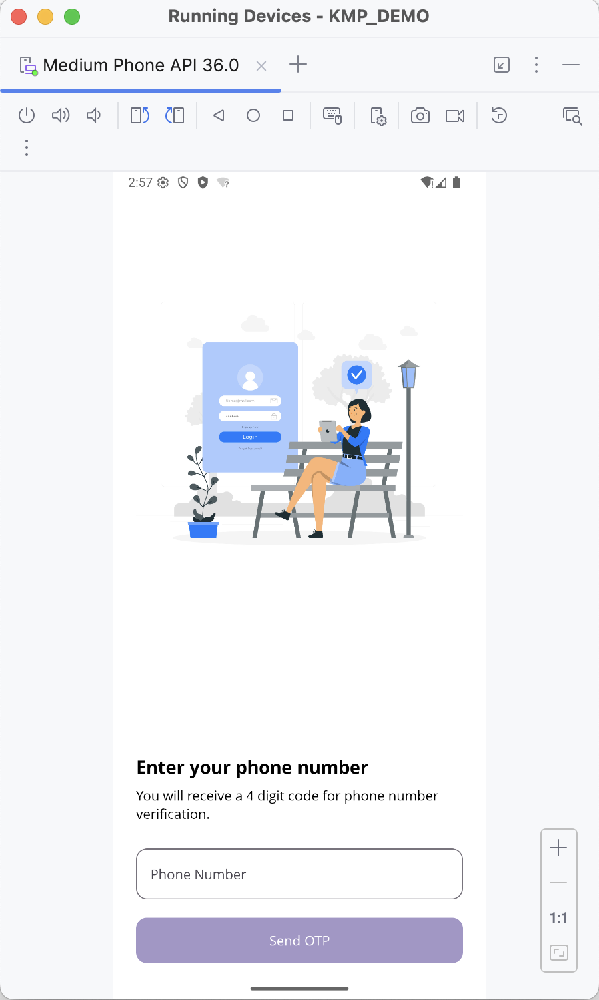
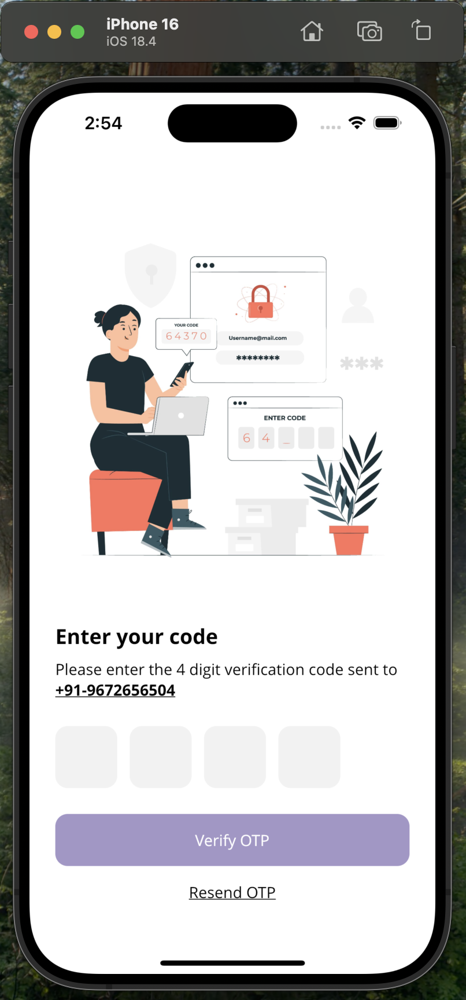
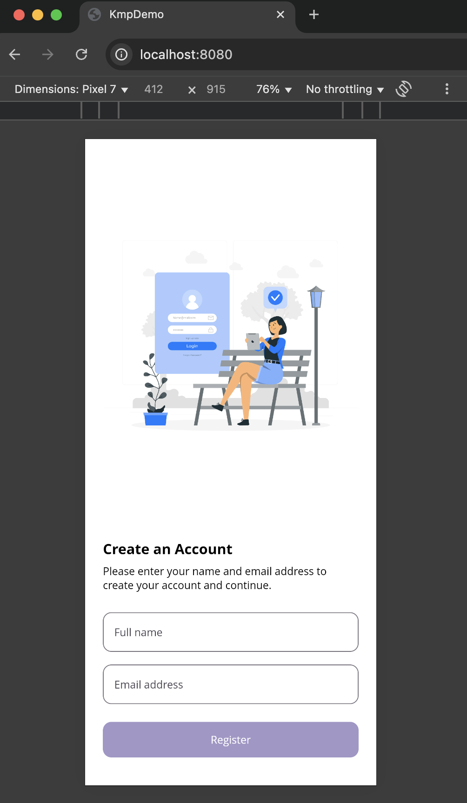

# 🌍 KMP Demo – A Kotlin Multiplatform Clean Architecture Starter

A complete, production-ready Kotlin Multiplatform (KMP) starter project built with **Clean Architecture** (MVVM), **Jetpack Compose Multiplatform (JCM)**, and support for **Android**, **iOS**, and **Web** platforms.

---

## 📸 Screenshots

| Android | iOS | Web |
|--------|-----|-----|
|  |  |  |

> 💡 *Screenshots shown: Login screen (Android), Otp screen (iOS), Registration screen (Web)*

---

## ✨ Features

- ✅ **Clean Modular Architecture**  
  Clear separation into `data`, `domain`, `usecase`, and `presentation` layers for maintainability and testability.

- 🧠 **MVVM Pattern with ViewModel & StateFlow**  
  Reactive UI driven by clean state and side-effect management using Kotlin Coroutines and StateFlow.

- 💼 **UseCase and Repository Pattern**  
  Business logic encapsulated and reused across all platforms.

- 🧩 **Jetpack Compose Multiplatform (JCM) – Shared UI Layer**  
  UI code is written once and shared across:  
  - 📱 **Android** using Compose UI  
  - 🍏 **iOS** via Compose binary frameworks  
  - 🌐 **Web** using WebAssembly (`wasmJs`) and Compose for Web  

  Benefits include:  
  - Shared themes, colors, dimensions, and custom UI components  
  - Unified navigation system, including a reusable Bottom Navigation Menu  
  - Consistent, state-driven UI powered by shared ViewModels  
  - Fully declarative, reactive UI across all targets

- 📱 **Bottom Navigation Menu**  
  Reusable and consistent navigation setup with Compose Navigation.

- 🔐 **Robust Authentication Flow**  
  OTP verification and user registration implemented using clean MVVM + UseCase layers.

- 🎨 **Custom Multiplatform Resources**  
  Shared colors, typography, strings, and dimension resources for consistent styling.

- 🌐 **Web Support (Wasm)**  
  Compose UI compiled to WebAssembly for modern web browsers with Kotlin/JS integration.

- 🔌 **Ktor for Networking**  
  Platform-specific HTTP clients (OkHttp on Android, Darwin on iOS, JS client for Web) with a shared API interface.

- 💉 **Koin for Dependency Injection**  
  Shared DI setup across all modules and platforms for easy configuration and testing.

- ⚙️ **Kotlin Coroutines**  
  For asynchronous programming, API calls, and smooth state updates.

- 🛠 **Multiplatform Settings**  
  Cross-platform key-value storage abstraction for managing preferences and app state.

---

## 🧱 Architecture Overview

### Clean Modular MVVM

- **Domain Layer**: Defines core business entities and repository interfaces.
- **Data Layer**: Implements repository interfaces; handles networking, caching, and local data.
- **UseCase Layer**: Contains business logic orchestrated by use cases.
- **Presentation Layer**: Implements MVVM with `ViewModel`, exposes UI state with `StateFlow` and `SharedFlow`.
- **Shared UI Layer**: Built with Jetpack Compose Multiplatform, shared across Android, iOS, and Web.

---

## 🚀 Getting Started

### Prerequisites

- Android Studio Arctic Fox or later
- Xcode 13+ (for iOS builds)
- Node.js and Yarn (for Web support)
- Kotlin 2.1.21 (compatible with your setup)
- Gradle 8.7.3

### Build & Run

- **Android**:  
  Open the `:composeApp` module in Android Studio and run on emulator or device.

- **iOS**:  
  Use Xcode to open the generated Compose framework and run on simulator/device.

- **Web**:  
  Run `./gradlew jsBrowserRun` to start a local webpack dev server for WebAssembly.

---

## 🛠 Dependencies & Versions

| Library                      | Version   |
|------------------------------|-----------|
| Android Gradle Plugin (AGP)  | 8.7.3     |
| Kotlin                      | 2.1.21    |
| Coroutines                  | 1.10.1    |
| Jetpack Compose Multiplatform| 1.8.1    |
| Ktor                        | 3.1.3     |
| Koin                        | 4.0.2     |
| AndroidX Lifecycle           | 2.9.0     |
| Navigation Compose           | 2.9.0-beta01 |
| Multiplatform Settings       | 1.1.1     |

---

## 📂 Project Structure

```plaintext
├── composeApp             # Compose Multiplatform application module (UI)
├── domain                 # Business logic, entities, use cases interfaces
├── data                   # Data sources and repository implementations
│   ├── local              # Local database or preferences implementation
│   ├── network            # Network API clients and models
│   └── auth               # Authentication related data layer
├── shared                 # Shared resources like strings, themes, styles
│   └── resources          # Multiplatform resource definitions
├── usecase                # Use case implementations
├── presentation           # UI logic and ViewModels, organized by features
│   ├── authentication
│   ├── home
│   ├── profile
│   ├── schedule
│   └── diy
└── build.gradle.kts       # Build scripts and plugin configurations
```
---

## 📖 Core Concepts

### ViewModel & MVVM  
ViewModels hold UI state in `StateFlow` and side-effects in `SharedFlow`, exposing a unidirectional data flow pattern. The UI reacts to state changes consistently across all platforms.

### UseCase Pattern  
Each business action is encapsulated in a UseCase class, promoting single responsibility and testability.

### Repository Pattern  
Abstracts data sources, providing a clean API for UseCases, making it easy to swap or mock implementations.

### Bottom Navigation Menu  
Implemented with Jetpack Compose Navigation, supporting shared and platform-specific navigation logic.

---

## 🤝 Contribution

Contributions, issues, and feature requests are welcome! Feel free to open a pull request or issue.

---

## 📄 License

MIT License © 2025 Amit Kumar Yadav

